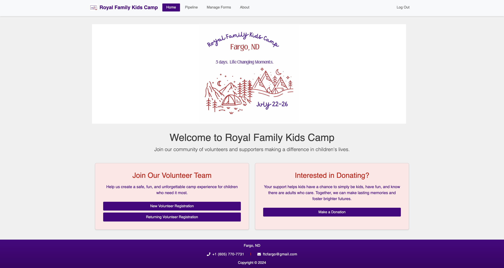
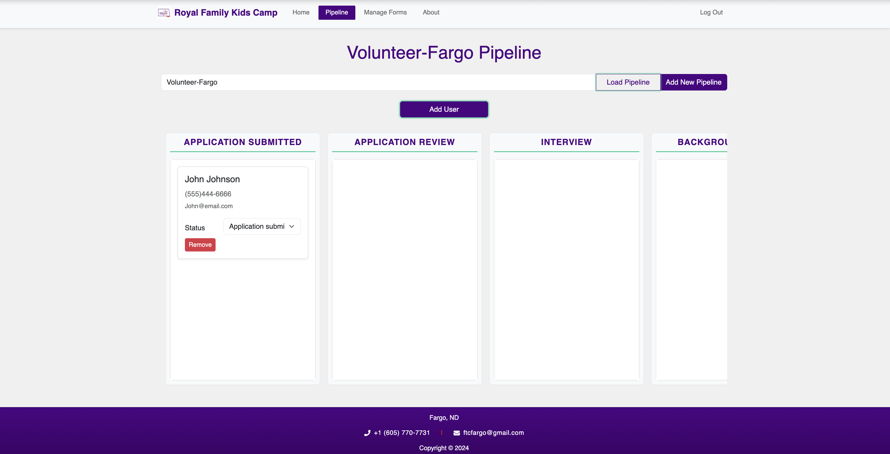
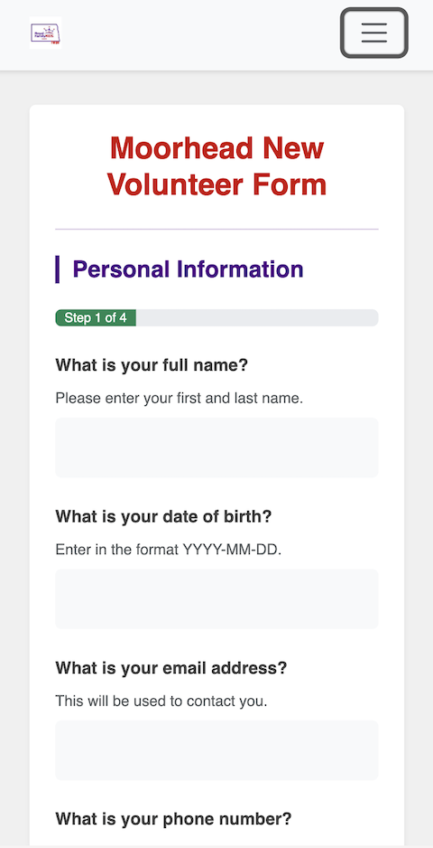

# RFKC Volunteer Management System

## Description

A web-based volunteer signup and management system designed for RFKC (Royal Family Kids Camp) to streamline the process of submitting and processing volunteer applications, donor/donation management, and organizational workflows across multiple locations.

## Features

- Multi-location support
- Custom form builder and management
- Pipeline tracking for volunteers and donors
- User role management (internal/portal)
- Dynamic form submissions
- Automated workflow progression
- Donation tracking

## Prerequisites

- Node.js (v16 or higher)
- PostgreSQL (v14 or higher)
  - https://www.postgresql.org/download/
  - required extension for PostGres fuzzy search: pg_trgm
- npm or yarn package manager

# Installation

1. Clone the repository

After cloning the repository, install the dependencies

```
npm install
```

2. Database Setup

Create a new PostgreSQL database

```
createdb rfkc
```

3. Run the database.sql file to set up tables and seed data

4. Start the application

Start the server

```
npm run server
```

In a separate terminal, start the client

```
npm run client
```

## Database Structure

The application uses 13 tables:

- user: User account information
- location: Available locations
- user_location: User-location associations
- donation: Donation records
- pipeline: Workflow pipelines
- pipeline_status: Status stages within pipelines
- user_status: User progress in pipelines
- forms: Custom forms
- submission: Form submissions
- sections: Form sections
- question: Form questions
- answer: User answers
- multiple_choice_answers: Predefined answer options

## API Endpoints

### User Routes

- POST /api/user/register
- POST /api/user/login
- POST /api/user/logout
- GET /api/user/

### Forms Routes

- GET /api/forms
- POST /api/forms
- PUT /api/forms/:id
- DELETE /api/forms/:id

### Submissions Routes

- GET /api/submission
- POST /api/submission
- PUT /api/submission/:submissionId/submit

## Technologies Used

- Frontend:

  - React
  - Zustand
  - Bootstrap
  - Bootstrap React

- Backend:

  - Node.js
  - Express
  - PostgreSQL
  - Passport.js

- Development:
  - Nodemon
  - pg
  - dotenv

## Security

- Password hashing and salting using bcrypt
- Session-based authentication
- SQL injection protection
- Environment variable protection

## Testing Instructions

### API Testing with Swagger

2. Access Swagger UI:

- Navigate to `http://localhost:5001/api-docs` in your browser
- The Swagger interface provides interactive documentation for all API endpoints

### Testing Endpoints

1. Authenticate in Swagger:

   - Execute the `/api/user/login` endpoint with valid credentials
   - All subsequent requests will use this authentication

## Application Screenshots

### Home Page


_Home page with cards for volunteering and donating_

### Form Builder


_Custom form builder interface for administrators_

### Volunteer Pipeline


_Pipeline view showing volunteer progression through stages_

### Mobile View


<br>
_Responsive mobile interface for volunteers, depiction of form page_

## Acknowledgments

- Royal Family Kids Camp organization
- Emerging Digital Academy
